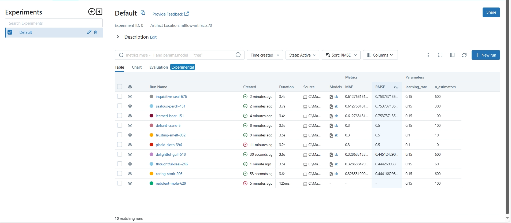
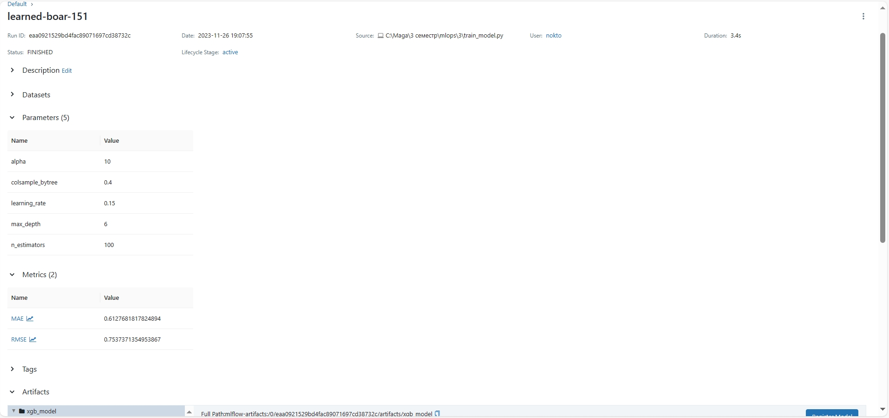

# MLOps задание №3

## Задача

Применить airflow и mlflow в задаче машинного обучения.

## Комментарии к решению

В данной задаче я выполнил следующие шаги:

1. Загрузил датасет с платформы kaggle.com с помощью `download.py`.
2. Провел предобработку данных через `preprocess.py`.
3. Обучил модель с использованием XGBoost через `train_model.py`.
4. Оценил полученные результаты через `evaluate.py`.

Была выбрана задача предсказания цены. Все параметры и метрики экспериментов сохранены в mlflow. Ниже приложены скриншоты web UI mlflow.

